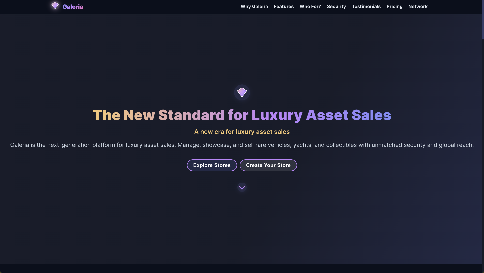

# 🛒 Galeria – Modern E-Commerce Platform

A comprehensive, full-stack e-commerce platform built with modern technologies.  
Supports both Turkish and English languages, serving global markets with advanced features for customers, sellers, and administrators.



---

## 🚀 Technology Stack

### 🧠 Backend
- **Node.js** & **Express.js 5.1.0** - Robust server framework
- **MongoDB** & **Mongoose 8.15.1** - NoSQL database with ODM
- **JWT Authentication** - Secure token-based authentication
- **Google OAuth** - Social login integration
- **Cloudinary** - Cloud image management
- **Multer** - File upload handling
- **bcryptjs** - Password hashing
- **RESTful API** - Clean API architecture

### 🎨 Frontend
- **React 19.1.0** - Latest React with hooks and context
- **Material-UI 7.1.1** - Modern UI component library
- **React Router DOM 7.7.1** - Advanced client-side routing
- **GSAP 3.13.0** - Professional animations
- **Axios** - HTTP client for API communication
- **React Icons** - Comprehensive icon library
- **React Toastify** - User notifications
- **Recharts** - Data visualization

---

## ✨ Key Features

### 🛍️ E-Commerce Core
- **Product Management** - Comprehensive CRUD operations
- **Shopping Cart** - Advanced cart with favorites
- **Order Management** - Complete order lifecycle
- **Payment Integration** - Secure payment processing
- **Search & Filtering** - Advanced search algorithms
- **Multi-language Support** - Turkish & English

### 👥 User Management
- **Multi-Role System** - Admin, Seller, Customer roles
- **Profile Management** - Detailed user profiles
- **Notification System** - Real-time notifications
- **Security** - JWT-based authentication
- **Google OAuth** - Social login

### 🏪 Seller Features
- **Store Creation** - Easy store setup process
- **Product Management** - Bulk upload and editing
- **Sales Analytics** - Detailed sales reports
- **Order Management** - Seller dashboard
- **Onboarding** - Guided seller setup

### 📊 Admin Panel
- **User Management** - Complete user administration
- **Analytics Dashboard** - Sales and user analytics
- **System Settings** - Platform configuration
- **Admin Assignment** - Role management
- **Global Search** - Advanced search functionality

---

## 📁 Project Structure

```
e-commerce/
├── backend/                 # Node.js API Server
│   ├── controllers/        # API route handlers
│   ├── models/            # MongoDB schemas
│   ├── routes/            # API endpoints
│   ├── middlewares/       # Custom middleware
│   ├── config/            # Configuration files
│   └── server.js          # Main server file
├── client/                # React Frontend
│   ├── src/
│   │   ├── components/    # Reusable components
│   │   ├── pages/        # Page components
│   │   ├── contexts/     # React contexts
│   │   ├── api/          # API integration
│   │   └── styles/       # Global styles
│   └── public/           # Static assets
├── Galeria_Presentation.md # Project presentation
├── Galeri_Search.md      # Search documentation
└── README.md             # This file
```

---

## ⚙️ Installation & Setup

### Prerequisites
- Node.js (v18 or higher)
- MongoDB (local or cloud)
- npm or yarn package manager

### 1. Clone Repository
```bash
git clone https://github.com/Berkayssy/e-commerce.git
cd e-commerce
```

### 2. Backend Setup
```bash
cd backend
npm install

# Create .env file
cp .env.example .env
# Edit .env with your configuration:
# PORT=5000
# MONGO_URI=your_mongodb_connection_string
# JWT_SECRET=your_jwt_secret_key
# CLOUDINARY_CLOUD_NAME=your_cloudinary_name
# CLOUDINARY_API_KEY=your_cloudinary_key
# CLOUDINARY_API_SECRET=your_cloudinary_secret

npm run dev  # Development mode
# or
npm start    # Production mode
```

### 3. Frontend Setup
```bash
cd ../client
npm install
npm start  # Runs on http://localhost:3000
```

### 4. Build for Production
```bash
# Frontend
cd client
npm run build

# Backend
cd ../backend
npm start
```

---

## 🔒 Security Features

### Authentication & Authorization
- **JWT Tokens** - Secure session management
- **Role-based Access Control** - Admin, Seller, Customer permissions
- **Password Hashing** - bcryptjs for secure password storage
- **Input Validation** - Comprehensive data sanitization
- **CORS Protection** - Cross-origin request handling

### Data Protection
- **Environment Variables** - Secure configuration management
- **Request Validation** - Input sanitization and validation
- **Error Handling** - Secure error responses
- **File Upload Security** - Validated file uploads
- **API Rate Limiting** - Protection against abuse

### Future Security Enhancements
- **Two-Factor Authentication (2FA)**
- **OAuth 2.0 Integration**
- **API Key Management**
- **Request Encryption**
- **Audit Logging**

---

## 🚀 CI/CD Pipeline

### Current Setup
- **Git Version Control** - Code management and collaboration
- **Environment Management** - Development, staging, production
- **Manual Deployment** - Current deployment process

### Planned CI/CD Implementation
- **GitHub Actions** - Automated testing and deployment
- **Docker Containerization** - Consistent deployment environments
- **Automated Testing** - Unit, integration, and E2E tests
- **Code Quality Checks** - ESLint, Prettier, SonarQube
- **Security Scanning** - Dependency vulnerability checks
- **Performance Monitoring** - Load testing and optimization

### Deployment Strategy
- **Blue-Green Deployment** - Zero-downtime deployments
- **Rollback Capability** - Quick recovery from issues
- **Health Checks** - Automated system monitoring
- **Load Balancing** - Traffic distribution
- **CDN Integration** - Global content delivery

---

## ⚡ Performance Optimizations

### Frontend Optimizations
- **Code Splitting** - Lazy loading of components
- **Image Optimization** - Compressed and responsive images
- **Bundle Optimization** - Tree shaking and minification
- **Caching Strategy** - Browser and CDN caching
- **Lazy Loading** - On-demand component loading

### Backend Optimizations
- **Database Indexing** - Optimized query performance
- **Connection Pooling** - Efficient database connections
- **Caching Layer** - Redis for session and data caching
- **Compression** - Gzip/Brotli response compression
- **Rate Limiting** - API usage optimization

### Future Optimizations
- **Service Worker** - Offline functionality
- **Progressive Web App (PWA)** - Native app-like experience
- **Microservices Architecture** - Scalable service structure
- **GraphQL Integration** - Efficient data fetching
- **Real-time Features** - WebSocket implementation

---

## 📊 Technical Achievements

### Code Statistics
- **50+ React Components** - Modular and reusable
- **8+ API Controllers** - RESTful endpoints
- **8+ MongoDB Models** - Comprehensive data structure
- **20+ API Routes** - Complete CRUD operations
- **30+ React Pages** - Full user experience

### Implemented Features
✅ User Authentication & Authorization  
✅ Product Management System  
✅ Shopping Cart & Favorites  
✅ Order Management  
✅ Admin Dashboard  
✅ Seller Onboarding  
✅ Multi-language Support  
✅ Payment Integration  
✅ Search & Filtering  
✅ Notification System  
✅ Responsive Design  
✅ Security Implementation  

---

## 🎯 Business Value

### For Customers
- Seamless shopping experience
- Secure payment processing
- Multi-language support
- Advanced search capabilities
- Personalized recommendations

### For Sellers
- Easy store setup
- Comprehensive product management
- Sales analytics
- Order management tools
- Marketing capabilities

### For Administrators
- Complete platform control
- User management
- Analytics and reporting
- System configuration
- Security monitoring

---

## 🔮 Future Roadmap

### Q1 2024
- [ ] CI/CD Pipeline Implementation
- [ ] Automated Testing Suite
- [ ] Performance Optimization
- [ ] Security Enhancements

### Q2 2024
- [ ] Mobile Application (React Native)
- [ ] AI-Powered Recommendations
- [ ] Advanced Analytics Dashboard
- [ ] Real-time Notifications

### Q3 2024
- [ ] Blockchain Integration
- [ ] AR/VR Showroom Experience
- [ ] Multi-currency Support
- [ ] Advanced Search Algorithms

### Q4 2024
- [ ] Microservices Architecture
- [ ] Global CDN Deployment
- [ ] Advanced Security Features
- [ ] Enterprise Features

---

## 🤝 Contributing

1. Fork the repository
2. Create a feature branch (`git checkout -b feature/AmazingFeature`)
3. Commit your changes (`git commit -m 'Add some AmazingFeature'`)
4. Push to the branch (`git push origin feature/AmazingFeature`)
5. Open a Pull Request

---

## 📝 License

This project is licensed under the MIT License - see the [LICENSE](LICENSE) file for details.

---

## 📞 Contact

- **Project Link**: [https://github.com/Berkayssy/e-commerce](https://github.com/Berkayssy/e-commerce)
- **Documentation**: See `Galeria_Presentation.md` for detailed project overview

---

*Built with ❤️ using modern web technologies*

